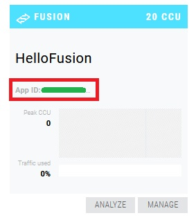

# Photon Engine アカウントとアプリケーションの作成
SDK のダウンロードなどに **Photon Engine アカウント** の作成が必要です。 
また、Photon を使ったアプリケーションを動作させるためにはダッシュボード上で **アプリケーションを作成** する必要があります。

## Photon Engine アカウントの作成
1. [サインアップページ](https://id.photonengine.com/en-US/Account/SignUp) からアカウントを作成します
2. 入力したメールアドレスに送信されるメールの指示に従ってアカウントを作成してください

## アプリケーションの作成
1. [ダッシュボード](https://dashboard.photonengine.com/en-US/)から **CREATE A NEW APP** を選択
2. 必要な項目を埋めて **CREATE** を選択
    * Photon Type は Photon Fusion
    * Name は Hello Fusion など自分で分かれば何でも OK
    * その他は空でも OK

## アプリケーション ID の確認
1. ダッシュボードで先ほど作ったアプリケーションの **App ID** を確認します
    * Unity 上での設定に必要なためメモしておいてください
    * 