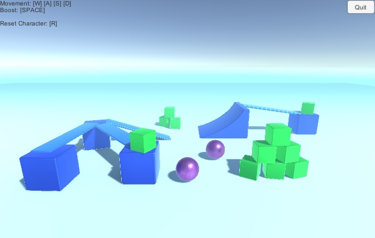

# Photon Fusion Sample Introduction(Hello Fusion)
Photon Fusion のサンプルデモのひとつ「Hello Fusion」を Unity 上で動作させるための手順を説明します

## 手順
1. [Photon Engine アカウントとアプリケーションの作成](./CreateAccountAndApp.md)
2. サンプルデモの実行

## 動作確認環境
* Unity 2020.3.13f1
* Hello Fusion Ver 0.5.0

## リンク
* [Photon Fusion - 数億人規模の未来のプレイヤーのパフォーマンス基準へ](https://support.photonengine.jp/hc/ja/articles/900006021486-Photon-Fusion-%E6%95%B0%E5%84%84%E4%BA%BA%E8%A6%8F%E6%A8%A1%E3%81%AE%E6%9C%AA%E6%9D%A5%E3%81%AE%E3%83%97%E3%83%AC%E3%82%A4%E3%83%A4%E3%83%BC%E3%81%AE%E3%83%91%E3%83%95%E3%82%A9%E3%83%BC%E3%83%9E%E3%83%B3%E3%82%B9%E5%9F%BA%E6%BA%96%E3%81%B8)
  * Photon のブログ記事
  * Fusion の特徴について記載
* [Hello Fusion](https://doc.photonengine.com/en-us/fusion/current/hello-fusion/hello-fusion)
  * サンプルデモ「Hello Fusion」のダウンロードページ