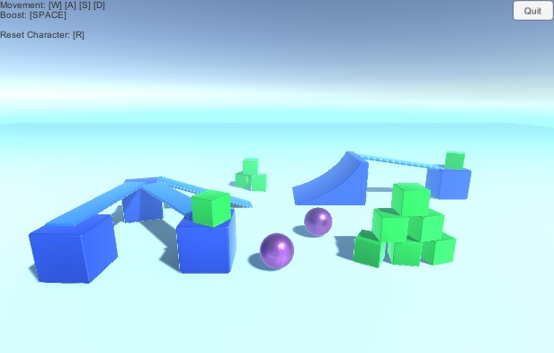

# サンプルデモの実行
Photon Fusion のサンプルデモとして公開されてある Hello Fusion を動作させて、実際に通信を行ってみます

## 手順
1. サンプルデモプロジェクトのインポート
2. プロジェクトの設定
3. プロジェクトのビルド
3. デモの実行

## サンプルデモプロジェクトのインポート
1. [ダウンロードページ](https://doc.photonengine.com/en-us/fusion/current/hello-fusion/hello-fusion) より Hello Fusion のパッケージをダウンロード
    * Fusion-HelloFusion-0.5.0.unitypackage
2. Unity で新規 3D プロジェクトを作成
3. Assets > Import Package > Custom Package... を選択
4. ダウンロードした unitypackage を選択し Import

## プロジェクトの設定
1. Unsafe なコードの実行の許可
    * Edit > Project Settings... > Player > Other Settings > **Allow 'unsafe' Code** のチェックを入れる
1. アプリケーション ID の設定
    * Assets/Photon/Fusion/Resources/PhotonAppSettings.asset を選択
    * App Settings > App Id Realtime の欄にダッシュボードで作成したアプリケーションの App Id を指定
    * 
1. デフォルトルーム名の設定
    * Assets/Scenes/SampleScene.unity を開く
    * ヒエラルキーから NetworkDebugStart を選択
    * Network Debug Start コンポーネントの Default Room Name に適当な名前(ex. DefaultRoom)を入力
    * 

## プロジェクトのビルド
サンプルデモでは通信実験を行うため、二つアプリケーションを実行しなければなりません。 
Unity は同一プロジェクトを Unity エディタで二つ同時に開くことができないので片方はビルドした exe を使います。 
デフォルトだとフルスクリーン実行されるので Player Settings > Resolution and Presentation > Resolution > Fullscreen Mode を Windowed にしておくとよいです 
(開発中は面倒なため [ParrelSync](https://github.com/VeriorPies/ParrelSync) 等を使うことをおすすめします)

1. File > Build Settings... を選択
2. Add Open Scenes を選択して現在のシーンをビルド対象に含めます
3. Target Platform が PC 用になっていることを確認してビルド
    * 

## デモの実行
1. SampleScene を開いた状態でエディタ実行
    * 
2. Start Host を選択
    * 一番上のテキストフィールドはルーム名(のようです)
    * Start Host/Start Client でそれぞれ P2P ホスト or クライアントとして実行できます
    * Unity エディタ側はホストとして実行し、クライアントからの接続を待ち受けます
3. クライアントプログラムの実行
    * 先ほどビルドしてできた exe を実行
    * Start Client を選択
    * 接続ができるとプレイヤーキャラ(?)の球が表示されます
        * WSAD のキー操作で移動
        * ホスト/クライアント間で通信プレイできていることが確認できます
    * 
